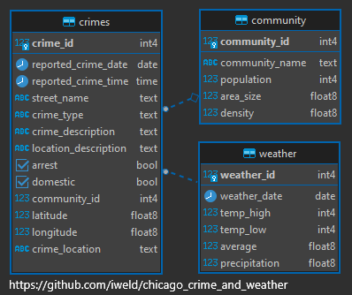

# Proceso de Carga y transformación de datos

**Author**: Carlos Gamero 

**Email**: cyjys87@gmail.com

**LinkedIn**: https://www.linkedin.com/in/carlos-gamero-8a131816/

## Resumen del Proyecto

Creacion de un pipeline de datos que recibe información de distintas fuentes y las almacena dentro de un datalake y luego dentro de un datamart en synapse. Y finalmente, muestra estadisticas en un dashboard en powerbi

## Arquitectura

## Estructura de Datos
